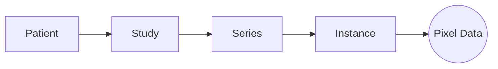

# Isocenter

[](https://doi.org/10.5281/zenodo.22104298)
[](https://pypi.org/project/isocenter/)
[](https://github.com/kvnlng/Isocenter/actions/workflows/tests.yml)
[](LICENSE)

**De-identify a DICOM cohort without touching the source files, and hand compliance a report that names anything the run could not do.**

Isocenter is a Python library for indexing, de-identifying, and exporting DICOM datasets at cohort scale. It builds a SQLite metadata index and a pixel/waveform sidecar beside a read-only source tree, applies your de-identification profile and pixel redaction rules to an in-memory object graph, grades its own output, and writes clean copies to a new directory as DICOM or PhysioNet WFDB.

## Who it is for

You have a cohort of studies and a protocol an IRB approved. You need to hand a de-identified copy to a collaborator, a registry, or a model, and to hand your compliance reviewer a record of what was removed, what stayed because the protocol allowed it, and anything the run lost on the way. Isocenter is the library your script imports to do that.

There is no command-line tool and none is planned. The Python API is the whole interface, because the people who de-identify cohorts write scripts, and a library that lives in the script can be paused, resumed, inspected, and audited in ways a batch command cannot.

## What it refuses to do

The behaviours that matter most are refusals, so they come first.

- **Modify a source file.** Ingest reads; anonymize and redact change an in-memory graph; nothing reaches disk until `export()` writes copies to a directory you name. A crashed or abandoned run leaves the originals exactly as they were.
- **Grade a lossy export `PASS`.** Every step that can lose data writes an audit row, and the compliance report reads those rows. A cohort that lost a file, a private tag, a waveform group, or a pixel frame grades `REVIEW_REQUIRED` and names the loss. A DICOM export that wrote nothing raises `ExportError` rather than returning quietly; a WFDB export records each failed record as an `ERROR` row and returns the records it did write ([#541](https://github.com/kvnlng/Isocenter/issues/541)).
- **Pass through pixels it could not decode.** If a compressed frame cannot be decompressed, because of a missing codec or a corrupt stream, the export fails on that instance rather than copying bytes it never inspected.
- **Advertise a Python version it does not test.** The suite runs on Python 3.12 and on the free-threaded 3.14t build on every pull request, and on all four supported versions at release. The classifiers on PyPI list only those, and a test fails if the matrix is narrowed without removing the classifier.

## What it does

- **Object model.** `Patient`, `Study`, `Series`, and `Instance` objects over pydicom, with attributes keyed by tag. Pixel and waveform data load lazily and can be released.
- **Persistent session.** Metadata is indexed in SQLite and heavy bytes in an append-only sidecar, so a 10,000-instance cohort reopens without rescanning, and a job can be paused and resumed. Every action is written to an audit log.
- **De-identification against the DICOM PS3.15 Annex E Basic Profile table.** A profile decides which tags go, are emptied, are replaced, or are date-shifted; a field the protocol permits stays. The built-in profile is Table E.1-1's Basic Profile column, edition 2026c, rule by rule, with its departures named. PHI detection walks nested sequences structurally, not only the top level. Date jitter is deterministic per patient within a project, keyed by a secret the export does not carry, so intervals survive. Study, Series and SOP Instance UIDs are not replaced, so an export stays linkable to its source by UID ([#544](https://github.com/kvnlng/Isocenter/issues/544)).
- **Machine-specific pixel redaction.** Redaction zones are keyed by device, because the same model in the same room burns identifiers into the same place every time. An optional OCR pass (`pip install "isocenter[ocr]"`) finds where text actually lands, and existing CTP `DicomPixelAnonymizer.script` rules import directly.
- **Reversible anonymization, if you choose it.** Original identities can be encrypted under a Fernet key and stored in a private tag before anonymization, and recovered later by whoever holds the key. The export discloses when recoverable identities are present.
- **Codecs.** Baseline JPEG decodes through Pillow, and RLE through pydicom's own decoder. JPEG Lossless, JPEG-LS and JPEG 2000 decode through pydicom's plugins where one is installed, and otherwise through `imagecodecs`. Strict validation on the way out.
- **Waveforms.** DICOM waveform IODs (ECG, hemodynamic) ingest alongside images and export as PhysioNet WFDB records, with a `<record>.annotations.json` bridge to [Murmur Studio](https://github.com/kvnlng/Murmur).
- **Parallelism that fits the interpreter.** Audit, pixel scanning and redaction use threads on free-threaded Python and processes elsewhere; ingest and export always use processes, and export recycles its workers to reclaim memory the imaging libraries leak. Tuned by environment variables documented in [`docs/environment.md`](docs/environment.md).

## Performance

One benchmark has a recorded run behind it: 100 multi-frame files, about 50 GB raw, ingest through export on an `n2-highmem-16`, January 2026. Across that run peak memory grew about 3x while the data grew 10x. The numbers, the machine, and the architecture that produced them are on the [performance page](https://kvnlng.github.io/Isocenter/performance/). Larger runs are planned; they will appear there when they exist, not here.

Sizing guidance from that run and from redaction and JPEG 2000 export work in practice:

- **Memory**: 2 GB RAM per vCPU as a floor; 8 GB per vCPU for heavy multi-frame JPEG 2000 export.
- **Concurrency**: one worker per CPU by default for ingest, audit and export; `redact()`, which holds a decoded frame per worker, defaults to half the CPUs and at most eight. Set `ISOCENTER_MAX_WORKERS` to limit both if a worker is killed for memory.

## Architecture

Isocenter is an indexing layer over your files, not a copy of them.

- **The `Session` facade** is the single entry point. It owns persistence, the inventory of patients, studies, and series, and the worker pool. It supports `with`, and `close()` releases the pool and the background threads.
- **The object graph** is `Patient → Study → Series → Instance`. An instance holds its pixel or waveform data through a loader that reads from the sidecar on demand.
- **Storage** has three tiers: standard tags in a JSON column queried with SQLite's JSON operators, private tags in a sparse attribute table, and pixel and waveform bytes in the sidecar by offset and length. `compact()` reclaims sidecar space.



### The pipeline

Ten steps, in the order the code expects them. Nothing touches disk until step 9, and the report comes last because export is where the last data-loss rows are written.

1. **Ingest**: build the index and sidecar from the source tree.
2. **Examine**: inventory the cohort and its equipment.
3. **Configure**: scaffold and edit the privacy profile and redaction rules.
4. **Audit**: measure PHI against the configuration.
5. **Backup** (optional): lock original identities under a key for reversibility.
6. **Anonymize**: apply metadata remediation, in memory.
7. **Redact**: scrub pixel zones for matched machines, in memory.
8. **Verify**: audit again and confirm a clean state.
9. **Export**: write clean files to a new directory.
10. **Report**: generate the compliance report from the audit log, including what export recorded.

## Installation

Isocenter requires **Python 3.12+** on a POSIX system (Linux or macOS). It does not import on Windows: the storage layer's locks use `fcntl`.

```bash
pip install isocenter
```

To install unreleased work from `main`, or to work on Isocenter itself:

```bash
pip install "git+https://github.com/kvnlng/Isocenter.git"

# or, for development
git clone https://github.com/kvnlng/Isocenter.git
cd Isocenter
pip install -e ".[dev]"
```

## Quick Start

### 1. Initialize a Session

A `Session` creates a local SQLite database to index your data, so you can pause, resume, and audit a job without rescanning thousands of files.

```python
from isocenter import Session

# Initialize a new session (creates 'isocenter.db' by default)
session = Session("my_project.db")
```

> **Tip:** `Session` supports the `with` statement: `with Session("my_project.db") as session:`. On exit it calls `session.close()` for you, releasing the background threads and worker pool the session holds -- steps 2-5 (including 5a) below work the same way indented inside that block. Step 7 ("Recover Identity") opens a *separate* `Session`, so it needs its own `with` block (or its own `close()` call) rather than being nested inside the first one. Leaving the block does **not** save: edits made since the last `save()` or `export()` are dropped, and `close()` warns naming the instances. `export()` saves the session itself before it writes, so after an export the store holds the de-identified graph, and the rows of patients whose identifier was replaced are removed.

> **Scripts need a main guard.** Isocenter starts its worker processes by *spawn* on every platform and Python build, and a spawned worker re-imports the script that launched it. In a `.py` file, put everything that uses the session under `if __name__ == "__main__":`; without it the first `ingest()` fails with `BrokenProcessPool`. Notebooks and the interactive interpreter need no guard.

### 2. Ingest & Examine

Ingestion builds the metadata index. Isocenter scans your folders recursively, extracting patient, study, and series information into the database *without moving or modifying your original files*. Nested directories and non-DICOM clutter are fine.

```python
session.ingest("/path/to/dicom/data")
session.save() # Persist the index to disk

# Print a summary of the cohort and equipment
session.examine()
```

### 3. Configure & Audit

Before changing anything, define your privacy rules.

1. Use `create_config` to generate a scaffold based on your inventory.

2. Edit that file for your protocol; see [Configuration](#configuration).

3. Use `audit` to scan the inventory against the rules.

Measure first, then cut: the audit tells you what the run will change before anything is changed.

Skipping configuration does not skip de-identification. A session that has loaded no configuration applies a **floor policy** of 620 tag rules: the PS3.15 Annex E Basic Profile table (2026c; UIDs not yet replaced), with Study Date jittered and Patient's Sex and Age kept. A config file extends that floor unless it says `privacy_profile: none`, and private tags are removed unless it says `remove_private_tags: false`. See [Configuration](https://kvnlng.github.io/Isocenter/configuration/).

```python
# Create a default configuration file (v2.0 YAML)
session.create_config("config.yaml")

# Load the configuration (rules, tags, jitter)
session.load_config("config.yaml")

# Run an audit to find PHI
report = session.audit() 
session.save_analysis(report)

print(f"Found {len(report)} potential PHI issues.")
```

### 4. Backup Identity (Optional)

To enable reversible anonymization, generate a key and lock the original patient identities into an encrypted private tag. This must be done *before* anonymization: locking after `anonymize()` raises `RuntimeError`, because there is no original value left to stash, and so does locking before `enable_reversible_anonymization()`. Locking again before anonymizing replaces the stored token. Encryption is Fernet (AES-128-CBC with HMAC-SHA256) from the `cryptography` package.

```python
# Enable encryption (generates 'isocenter.key')
session.enable_reversible_anonymization()

# cryptographically lock identities for all patients found in the audit
# Optional: Specify custom tags to preserve (defaults to Name, ID, DOB, Sex, Accession)
session.lock_identities(report, tags_to_lock=["0010,0010", "0010,0020", "0010,0030"])
session.save()
```

### 5. Anonymize, Redact & Export

Remediation happens in memory, then export writes the result:

1. **Anonymize**: strips, replaces, or shifts metadata tags according to your config.
2. **Redact**: loads pixel data and scrubs the configured zones on matched machines.
3. **Export**: writes clean files to a new directory. With `check_burned_in=True` the export runs `audit()` first and skips every instance that still carries an identifier. The skip is a logged warning only: it writes no audit row and is not counted in the report, which can grade a run that withheld everything `PASS` ([#536](https://github.com/kvnlng/Isocenter/issues/536)). Compare the returned summary against the cohort to see what was held back.

```python
# Apply metadata remediation (anonymization) using the findings
session.anonymize(report)

# Apply pixel redaction rules (requires config to be loaded)
session.redact()

# Export only safe (clean) data to a new folder
# Compression is on by default (lossless JPEG 2000); use_compression=False writes uncompressed
session.export("/path/to/export_clean", check_burned_in=True, use_compression=True)
```

`export()` returns a summary of what was written and raises `ExportError` if it planned files and delivered none. Files land at `Subject_<PatientID>/Study_<date>_<description>_<uid>/Series_<number>_<modality>_<description>_<uid>/<SOPInstanceUID>.dcm`; the directory names are built from the values being exported, so run `anonymize()` first or the real identifiers appear in the paths. A redacted instance takes a new SOP Instance UID, so its filename is not its source's. The [Quick Start guide](https://kvnlng.github.io/Isocenter/quickstart/) covers compression's effect on colour images and what `verify_readback=True` adds. Progress for the save, memory release, and export phases is displayed:

```text
Preparing for export (Auto-Save & Memory Release)...
Releasing Memory: 100%|██████████| 5000/5000 [00:02<00:00, 2000.00img/s]
Memory Cleanup: Released 5000 images from RAM.
Executing Redaction Rules...
Redacting: 100%|██████████| 150/150 [00:05<00:00, 28.00img/s]
Exporting session to: /path/to/export_clean
Exporting:  15%|██▌       | 15/100 [00:05<00:30,  2.80patient/s]
```

### 5a. Analytics & Subset Export

You can interrogate the cohort with pandas and export a subset chosen by metadata.

```python
# 0. Ensure that data is persisted to disk
session.save()

# 1. Get a DataFrame of the cohort
df = session.export_dataframe(expand_metadata=True)

# 2. Filter using Pandas
target_df = df[ (df.Modality == 'CT') & (df.SliceThickness > 2.5) ]

# 3. Export only the subset
session.export("export_thick_cts", subset=target_df)
```

You can also export the full inventory to Parquet for external tools:

```python
session.export_dataframe("cohort.parquet", expand_metadata=True)
```

### 5b. Zone Discovery (Burned-in Text)

Machines burn identifiers into the pixels themselves, and the same model in the
same room tends to burn them in the same place every time. `discover_redaction_zones()`
OCRs a random sample of one machine's instances and reports where text was found,
so you can write redaction zones from what the data actually does rather than from
one screenshot.

The scan itself needs the `ocr` extra (`pip install "isocenter[ocr]"`, which brings
`pytesseract`) and the `tesseract` binary, which pip cannot install. Without either,
`discover_redaction_zones()` raises `OcrUnavailableError`, a `RuntimeError`, naming
what is missing, instead of reporting that it found nothing; `scan_pixel_content()`
does the same. `isocenter.pixel_analysis.HAS_OCR` reports only whether `pytesseract`
imported, not whether the binary is there.
Everything on the returned `DiscoveryResult` — filtering, the DataFrame, the zone
grouping — is plain Python and needs no extra.

```python
# One machine at a time: zones are a property of the device, not the cohort.
result = session.discover_redaction_zones(
    "SN-12345", sample_size=50, min_confidence=80.0)

print(len(result))            # candidate text regions found
print(result.visualize_heatmap())   # ASCII sketch of where they landed

# Suggested zones, in the [y1, y2, x1, x2] form the redaction config takes.
for zone in result.to_zones(min_occurrence=0.25):
    print(zone["type"], zone["zone"], zone["examples"])
```

A `DiscoveryResult` holds `DiscoveryCandidate` records — `text`, `confidence`,
`box` (`[x, y, w, h]`), `source_index` (which sampled instance it came from) and
`classification`. It is iterable and sized, and `filter()` takes either a minimum
confidence or a predicate. `to_zones()` clusters the candidates, unions each
cluster's boxes, drops any merged box narrower or shorter than 6 pixels, and keeps
only clusters seen in at least `min_occurrence` of the sampled instances — a name
that appears in one frame out of fifty is noise, one that appears in forty is the
overlay. Each zone's `type` is `LIKELY_NAME` if any member matched the name
pattern, `PROPER_NOUN` if any was classified as one, and `TEXT` otherwise.

<!-- runnable: none -->
```python
>>> from isocenter.discovery import DiscoveryCandidate, DiscoveryResult
>>> result = DiscoveryResult([
...     DiscoveryCandidate("SMITH^JOHN", 92.0, [10, 8, 60, 12], 0, "NAME_PATTERN"),
...     DiscoveryCandidate("MERCY GENERAL", 88.0, [200, 180, 50, 10], 1, "PROPER_NOUN"),
... ], n_sources=2)
>>> list(result.to_dataframe().columns)
['text', 'confidence', 'box', 'source_index', 'classification']
>>> result.get_density_matrix(bins=(2, 2))
[[1, 0], [0, 1]]
>>> result.to_zones(min_occurrence=0.5)
[{'zone': [8, 20, 10, 70], 'type': 'LIKELY_NAME', 'occurrence': 0.5, 'confidence': 92.0, 'examples': ['SMITH^JOHN']}, {'zone': [180, 190, 200, 250], 'type': 'PROPER_NOUN', 'occurrence': 0.5, 'confidence': 88.0, 'examples': ['MERCY GENERAL']}]
```

`to_dataframe()` needs only pandas, which Isocenter already depends on.

**`get_density_matrix()` is not an image-space heatmap, and the difference matters.**
It bins each candidate's box *centre* into a grid, but it normalises by the largest
box *origin* among the candidates — not by the image's Rows and Columns. The grid
therefore stretches to fit whatever was found, so two scans of the same machine are
not comparable to each other and neither is comparable to the image; a centre lying
past the largest origin clamps into the last bin. Read it as "where did the hits fall
relative to each other", and take the actual coordinates from `to_zones()` or from
each candidate's `box`.

### 6. Report

The report comes last, after export, because export is where the final data-loss rows are written. A report generated before any export says so in its own text.

```python
# Generate the compliance report after processing
session.generate_report("compliance_report.md")
```

### 7. Recover Identity (Optional)

If you have the key (`isocenter.key`) and need the original identity of an anonymized patient, load the session under that key. `enable_reversible_anonymization()` **creates a new key** when none exists at the path you give it, so point it at the key the data was locked with; under any other key recovery finds nothing and prints `No encrypted identity token found or decryption failed.` ([#539](https://github.com/kvnlng/Isocenter/issues/539)):

```python
# Load the session containing anonymized data
session = Session("my_project.db")
session.enable_reversible_anonymization("isocenter.key")

# Recover the original PatientName and PatientID
# Recover the original identity and restore attributes in-memory
# restore=True (default) automatically updates the instance with original values
session.recover_patient_identity("ANON_5b5ce7b47f254ef3a0d90c0f", restore=True)

# Now, accessing p.patient_name or instance attributes returns original data
print(f"Restored: {session.store.patients[0].patient_name}")
```

## Configuration

One YAML file controls de-identification. See the **[Configuration Guide](https://kvnlng.github.io/Isocenter/configuration/)** for the full reference.

### Example `config.yaml`

```yaml
# 1. Privacy Profile (Optional)
# Options: "basic", "none", or path to external YAML
privacy_profile: "basic"

# 2. Date Jitter
date_jitter:
  min_days: -30
  max_days: -10

# 3. Custom PHI Tags
phi_tags:
  "0008,0080": { "action": "REMOVE", "name": "InstitutionName" }

# 4. Pixel Redaction Rules
machines:
  - serial_number: "DEV12345"
    model_name: "UltraSound Pro"
    redaction_zones:
      - [0, 50, 0, 800] # ROI: [row_start, row_end, col_start, col_end]
```

## The compliance report

`generate_report()` writes a Markdown document from the session's audit log:

- **Cohort summary**: how many patients and instances the session holds and, after an export, how many instances were written of those requested. A per-instance manifest is a separate document, `generate_manifest()`.
- **Audit trail**: counts of every action taken (anonymize, redact, export) and every loss recorded.
- **Exceptions**: every warning and error the run raised, listed rather than summarised.
- **Grade**: `PASS` or `REVIEW_REQUIRED`. There is no `FAIL`; a run that lost something is a run a person must look at, and the report's *Grade Basis* lists every reason it is not `PASS`.
- **A signature block** for the reviewer who accepts it. The report is evidence for whatever review your institution runs; it is not itself a certification.

Two screens run during processing and feed the report: instances whose `BurnedInAnnotation (0028,0301)` is `YES` are flagged for manual review, and every exception in a batch is captured rather than dropped.

## Migrating from CTP

Isocenter reads Clinical Trial Processor `DicomPixelAnonymizer.script` files and converts them to its YAML rules:

```bash
# Convert CTP script to Isocenter YAML
python -m isocenter.utils.ctp_parser /path/to/anonymizer.script output_rules.yaml
```

The parser carries over manufacturer and model matching and the redaction zones, converting CTP's `x,y,w,h` to Isocenter's `[row_start, row_end, col_start, col_end]`.

## Waveforms

DICOM waveform IODs ingest like any other instance, and export as PhysioNet WFDB records:

```python
session.export("/path/to/wfdb_out", format="wfdb")
```

Each record is written with a `<record>.annotations.json` file that Murmur Studio reads. Multi-group waveform records are not yet supported end to end; ingest keeps the first group, warns, and writes a `DATA_LOSS` audit row so the report grades the run `REVIEW_REQUIRED` rather than passing it. The [waveform guide](https://kvnlng.github.io/Isocenter/waveforms/) has the details and the current limits.

## Citing Isocenter

If Isocenter's de-identification is part of how a dataset was prepared,
it belongs in the methods section rather than the acknowledgements. Use
GitHub's **Cite this repository** button, which reads `CITATION.cff`.

Each release is archived on Zenodo. Cite the concept DOI,
[10.5281/zenodo.22104298](https://doi.org/10.5281/zenodo.22104298), which
always resolves to the latest version -- not the per-version DOI, so the
citation follows the work rather than freezing on whichever version was
current when you wrote it. If you need to record the exact version used,
name it in the text (`Isocenter v0.9.2`) and leave the DOI pointing at
the concept record.

Isocenter is the upstream half of a pair: it builds and de-identifies the
corpus that [Murmur Studio](https://github.com/kvnlng/Murmur)
([10.5281/zenodo.21077528](https://doi.org/10.5281/zenodo.21077528))
reviews. Work that used both should cite both.

## License

Apache License 2.0. See [`LICENSE`](LICENSE) and [`NOTICE`](NOTICE).

Releases up to and including 0.9.2 were published under the GNU Affero General Public License v3.0 or later and remain available under it; the change is not retroactive. If you cite Isocenter, `CITATION.cff` carries the DOI and the license together.

## Contact

Bug reports and questions about documented behaviour go to [GitHub Issues](https://github.com/kvnlng/Isocenter/issues); they are answered there, in public, for free.

Help beyond that is available as paid consulting: configuring a de-identification profile for a protocol, integrating Isocenter into a pipeline, reviewing a run's report before it goes to a reviewer, or a feature your study needs sooner than the roadmap. Write to <support@isocenter.net> with what you need, and use the same address for anything that should not be public.
