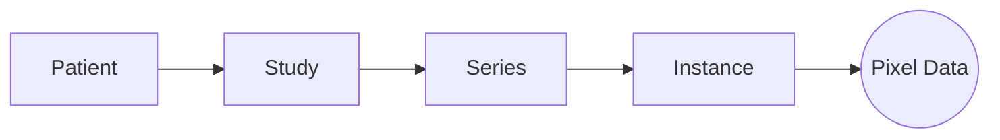

# Isocenter

[](https://doi.org/10.5281/zenodo.22104298)

**A Python DICOM Object Model and Redaction Toolkit.**

Isocenter provides a high-performance, object-oriented interface for managing, analyzing, and de-identifying DICOM datasets. It is designed for large-scale ingestion, precise pixel redaction, and strict PHI compliance.

## Features

- **Object-Oriented API**: Work with `Patient`, `Study`, `Series`, and `Instance` objects directly.
- **Persistent Sessions**: All metadata is indexed in a SQLite database, allowing you to pause/resume large jobs and providing an audit trail.
- **Parallel Processing**: Multi-process ingestion and export for maximum throughput.
- **Robust Redaction**:
  - **Metadata**: Configurable tag removal, replacement, and shifting.
  - **Pixel Data**: Machine-specific redaction zones (ROI) to scrub burned-in PHI.
  - **Reversibility**: Optional cryptographic identity preservation.
- **Codecs**: Robust support for JPEG Lossless, JPEG 2000, and other compressed formats via `imagecodecs`.
- **Waveforms**: Ingest DICOM waveform IODs (ECG, hemodynamic) and export PhysioNet WFDB records, bridging to [Murmur Studio](https://github.com/kvnlng/Murmur).
- **Free-threaded Python Ready**: `run_parallel()` uses threads rather than processes when there is no GIL to escape, for true parallelism. Tested on **3.14t** (`PYTHON_GIL=0`) on every pull request and again at release.
- **Enterprise-Grade Scalability**:
  - **Process-Isolated Redaction**: Guarantees zero memory leaks by isolating heavy pixel operations.
  - **Deep Memory Management**: Validated sub-linear memory scaling on 100GB+ datasets.

## Performance

Benchmark performed by producing instances with frames ranging from 1 to 100 in three phases. Each phase increases in single magnitude. Then a standard workflow is performed, measuring each step. The final results follow.

| Phase                           | Total Instances | Ingest Duration | Examine Duration | Audit Duration | Backup Duration | Anonymize Duration | Redact Duration | Export Duration | Total Time |
|:--------------------------------|:---------------:|----------------:|-----------------:|---------------:|----------------:|-------------------:|----------------:|----------------:|-----------:|
| 0                               | 1               | 2.20            | 0.0001           | 0.0014         | 0.0061          | 0.0066             | 1.85            | 2.97            | 7.04       |
| 1                               | 10              | 22.45           | 0.0001           | 0.0024         | 0.0060          | 0.0064             | 9.33            | 9.94            | 41.74      |
| 2                               | 100             | 177.36          | 0.0002           | 0.0042         | 0.0124          | 0.0244             | 74.21           | 58.13           | 309.74     |

Test machine:
- machine-type: n2-highmem-16
- image-family: ubuntu-2204-lts
- image-project: ubuntu-os-cloud
- boot-disk-size: 1TB
- boot-disk-type: pd-ssd

## Architecture

Isocenter acts as a smart indexing layer over your raw DICOM files. It does *not* modify your original data. Instead, it builds a lightweight metadata index (SQLite) and exposes a clean Python Object Model for manipulation.

### 1. The Session Facade

The `Session` object is your single entry point. It manages:

- **Persistence**: Auto-saving state to `isocenter.db`.
- **Inventory**: Tracking Patients, Studies, and Series.
- **Transactions**: Atomic persistence of changes.

### 2. Object Model

Isocenter abstracts DICOM into a semantic hierarchy, removing the pain of manual tag iteration.



- **Patient**: Root entity (Name, ID).
- **Study**: A distinct visit/exam.
- **Series**: A scan or reconstruction (e.g., "ct_soft_kernel").
- **Instance**: A single DICOM slice.

### 3. Safety Pipeline (The 10 Checkpoints)

Isocenter provides a system to ensure data safety:

1. **Ingest**: Load raw data into the managed session index.
2. **Examine**: Inventory the cohort and equipment.
3. **Configure**: Define privacy tags and redaction rules.
4. **Audit**: Measure PHI risks against the configuration.
5. **Backup**: (*Optional*) Securely lock original identities for reversibility.
6. **Anonymize**: Apply remediation to metadata (in-memory).
7. **Redact**: Scrub pixel data for specific machines (in-memory).
8. **Verify**: Re-audit the session to ensure a clean state.
9. **Report**: Generate a signed Compliance Report (Manifest, Exceptions, Audit Trail).
10. **Export**: Write clean DICOM files to disk.

## Installation

Isocenter requires **Python 3.12+**.

```bash
pip install isocenter
```

To install unreleased work from `main`, or to work on Isocenter itself:

```bash
pip install "git+https://github.com/kvnlng/Isocenter.git"

# or, for development
git clone https://github.com/kvnlng/Isocenter.git
cd Isocenter
pip install -e ".[dev]"
```

## Citing Isocenter

If Isocenter's de-identification is part of how a dataset was prepared,
it belongs in the methods section rather than the acknowledgements. Use
GitHub's **Cite this repository** button, which reads `CITATION.cff`.

Each release is archived on Zenodo. Cite the concept DOI,
[10.5281/zenodo.22104298](https://doi.org/10.5281/zenodo.22104298), which
always resolves to the latest version -- not the per-version DOI, so the
citation follows the work rather than freezing on whichever version was
current when you wrote it. If you need to record the exact version used,
name it in the text (`Isocenter v0.8.1`) and leave the DOI pointing at
the concept record.

Isocenter is the upstream half of a pair: it builds and de-identifies the
corpus that [Murmur Studio](https://github.com/kvnlng/Murmur)
([10.5281/zenodo.21077528](https://doi.org/10.5281/zenodo.21077528))
reviews. Work that used both should cite both.

## System Requirements

Isocenter's parallel processing engine is designed to maximize CPU utilization. However, heavy operations like JPEG 2000 compression require significant memory per worker.

- **Memory**: Isocenter is memory-intensive during specific operations (e.g., Pixel Redaction, J2K Export).
  - **Minimum**: 2GB RAM per vCPU.
  - **Recommended (Heavy Workloads)**: 8GB RAM per vCPU (e.g., for massive multi-frame J2K compression).
- **Concurrency**: By default, Isocenter uses all available cores (`1:1` ratio). Use `ISOCENTER_MAX_WORKERS` env var to limit this if OOM occurs.

## Quick Start

### 1. Initialize a Session

Isocenter uses a **persistent session** to manage your workflow. Unlike scripts that run once and forget, a Session creates a local SQLite database (`isocenter.db`) to index your data. This allows you to pause, resume, and audit your work without re-scanning thousands of files.

```python
from isocenter import Session

# Initialize a new session (creates 'isocenter.db' by default)
session = Session("my_project.db")
```

> **Tip:** `Session` supports the `with` statement: `with Session("my_project.db") as session:`. On exit it calls `session.close()` for you, releasing the background threads and worker pool the session holds -- steps 2-5 (including 5a) below work the same way indented inside that block. Step 6 ("Recover Identity") opens a *separate* `Session`, so it needs its own `with` block (or its own `close()` call) rather than being nested inside the first one.

### 2. Ingest & Examine

Ingestion builds a lightweight **metadata index** of your DICOM files. Isocenter scans your folders recursively, extracting patient/study/series information into the database *without moving or modifying your original files*. It is resilient to nested directories and non-DICOM clutter.

```python
session.ingest("/path/to/dicom/data")
session.save() # Persist the index to disk

# Print a summary of the cohort and equipment
session.examine()
```

### 3. Configure & Audit

Before changing anything, define your privacy rules.

1. Use `create_config` to generate a scaffolding based on your inventory

2. Edit that config file for the required protocol [Configuration](#configuration)

3. Use `audit` to scan your inventory against the rules you created in the config file

This "Measure Twice, Cut Once" approach lets you identify all PHI risks before applying any irreversible changes.

```python
# Create a default configuration file (v2.0 YAML)
session.create_config("config.yaml")

# Load the configuration (rules, tags, jitter)
session.load_config("config.yaml")

# Run an audit to find PHI
report = session.audit() 
session.save_analysis(report)

print(f"Found {len(report)} potential PHI issues.")
```

### 4. Backup Identity (Optional)

To enable reversible anonymization, generate a cryptographic key and "lock" the original patient identities into a secure, encrypted DICOM tag. This must be done *before* anonymization. Our CryptoEngine handles encryption and decryption of bytes using Fernet symmetric key (AES-128-CBC w/ HMAC-SHA256)

```python
# Enable encryption (generates 'isocenter.key')
session.enable_reversible_anonymization()

# cryptographically lock identities for all patients found in the audit
# Optional: Specify custom tags to preserve (defaults to Name, ID, DOB, Sex, Accession)
session.lock_identities(report, tags_to_lock=["0010,0010", "0010,0020", "0010,0030"])
session.save()
```

### 5. Anonymize, Redact & Export

Remediation is a multi-stage process performed in-memory:

1. **Anonymize**: Strips or replaces metadata tags (PatientID, Names, Dates) based on your config.
2. **Redact**: Loads pixel data and scrubs burned-in PHI from defined regions.
3. **Export**: The final "Gatekeeper". Writes clean files to a new directory. Setting `check_burned_in=True` ensures the export halts if any verification checks fail (e.g., corrupt images or missing codecs).

```python
# Apply metadata remediation (anonymization) using the findings
session.anonymize(report)

# Apply pixel redaction rules (requires config to be loaded)
session.redact()

# Export only safe (clean) data to a new folder
# use_compression=True optionally compresses output to JPEG 2000
session.export("/path/to/export_clean", check_burned_in=True, use_compression=True)
```

Progress for the save, memory release, and export phases will be displayed:

```text
Preparing for export (Auto-Save & Memory Release)...
Releasing Memory: 100%|██████████| 5000/5000 [00:02<00:00, 2000.00img/s]
Memory Cleanup: Released 5000 images from RAM.
Executing Redaction Rules...
Redacting: 100%|██████████| 150/150 [00:05<00:00, 28.00img/s]
Exporting session to: /path/to/export_clean
Exporting:  15%|██▌       | 15/100 [00:05<00:30,  2.80patient/s]
```

### 5a. Analytics & Export

Isocenter supports **Exploratory Data Analysis (EDA)**. You can interrogate your cohort using Pandas and perform targeted exports based on metadata criteria.

```python
# 0. Ensure that data is persisted to disk
session.save()

# 1. Get a DataFrame of the cohort
df = session.export_dataframe(expand_metadata=True)

# 2. Filter using Pandas
target_df = df[ (df.Modality == 'CT') & (df.SliceThickness > 2.5) ]

# 3. Export only the subset
session.export("export_thick_cts", subset=target_df)
```

You can also export the full inventory to Parquet for external tools

```python
session.export_dataframe("cohort.parquet", expand_metadata=True)
```

### 6. Recover Identity (Optional)

If you have a valid key (`isocenter.key`) and need to retrieve the original identity of an anonymized patient:

```python
# Load the session containing anonymized data
session = Session("my_project.db")
session.enable_reversible_anonymization("isocenter.key")

# Recover the original PatientName and PatientID
# Recover the original identity and restore attributes in-memory
# restore=True (default) automatically updates the instance with original values
session.recover_patient_identity("ANON_12345", restore=True)

# Now, accessing p.patient_name or instance attributes returns original data
print(f"Restored: {session.store.patients[0].patient_name}")
```

## Configuration

Isocenter uses a **Unified YAML Configuration** to control all aspects of de-identification.

### Example `config.yaml`

See the **[Complete Configuration Guide](https://kvnlng.github.io/Isocenter/configuration/)** for a full reference.

```yaml
# 1. Privacy Profile (Optional)
# Options: "basic", "comprehensive", or path to external YAML
privacy_profile: "basic"

# 2. Date Jitter
date_jitter:
  min_days: -30
  max_days: -10

# 3. Custom PHI Tags
phi_tags:
  "0010,0010": { "action": "REMOVE", "name": "PatientName" }

# 4. Pixel Redaction Rules
machines:
  - serial_number: "DEV12345"
    model_name: "UltraSound Pro"
    redaction_zones:
      - [0, 50, 0, 800] # ROI: [row_start, row_end, col_start, col_end]
```

## Advanced Features

### Pixel Redaction

Isocenter can scrub burned-in PHI from pixels based on matching the equipment's `DeviceSerialNumber`. Define `redaction_zones` in your config to automatically verify and scrub these regions during export/anonymization.

### Reversible Anonymization

To maintain a secure link back to the original identity:

```python
# Enable encryption (generates 'isocenter.key')
session.enable_reversible_anonymization()

# Lock identities BEFORE anonymization to store encrypted original data
# You can specify exactly which tags to preserve
session.lock_identities("PATIENT_123", tags_to_lock=["0010,0010", "0010,0030"])
```

Users can later recover the identity if they possess the correct key:

```python
session.recover_patient_identity("ANON_123")
```

### Strict Codec & Export Safety

Isocenter performs strict validation during export. If a compressed image cannot be decompressed (e.g., due to missing codecs or corruption), the export **will fail** rather than passing through unverified data. This ensures 100% PHI safety.

Supported Transfer Syntaxes:

- JPEG Lossless (Process 14, SV1)
- JPEG 2000 (Lossless & Lossy)
- JPEG-LS
- RLE Lossless
- Standard JPEG Baseline/Extended

## Compliance & Certification

### 1. Automated Compliance Reports

Generate single-step, audit-ready Markdown reports for HIPAA/GDPR documentation. Reports include:

- **Cohort Manifest**: Summary of all processed patients/studies.
- **Audit Trail**: Aggregated counts of every action (Anonymize, Redact, Export).
- **Exceptions**: Explicit listing of any warnings or errors encountered.
- **Validation Status**: Automatic `PASS`/`REVIEW_REQUIRED` grading.

```python
# Generate a formal report after processing
session.generate_report("compliance_report.md")
```

### 2. Safety Checks

Isocenter can screen for high-risk attributes:

- **Burned-In Annotation Check**: Flags images where `BurnedInAnnotation (0028,0301)` is "YES", enforcing manual review.
- **Exception Tracking**: Captures all system errors during batch processing for the final report.

## Migration Tools

### Clinical Trial Processor (CTP)

Isocenter includes a utility to convert legacy CTP `DicomPixelAnonymizer.script` files into Isocenter's YAML configuration format.

```bash
# Convert CTP script to Isocenter YAML
python -m isocenter.utils.ctp_parser /path/to/anonymizer.script output_rules.yaml
```

This parser extracts:

- Manufacturer/Model matching criteria.
- Redaction zones (automatically converting `x,y,w,h` to `r1,r2,c1,c2`).
