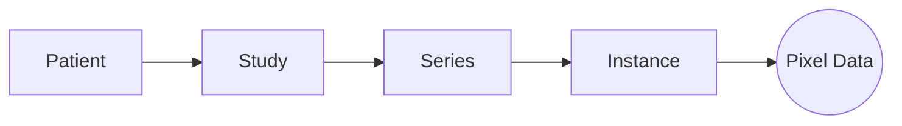

# Architecture

Isocenter is an indexing layer over your DICOM files. It never modifies them. It reads them into a session store (a SQLite index plus a pixel sidecar), changes an in-memory object graph, and writes de-identified copies to a new directory when you call `export()`.

## 1. The Session facade

The `Session` object is your single entry point. It manages:

- **The store**: `<name>.db` and `<name>_pixels.bin`, created by `Session("<name>.db")`. `ingest()` saves when it finishes and a DICOM `export()` saves before it writes; otherwise call `save()` yourself. `close()` does not save: it warns, naming the instances whose edits would be lost.
- **Inventory**: the patients, studies, series and instances the store holds.
- **Workers**: a process pool and two background threads. Use `with Session(...) as session:` or call `close()`, or the worker processes outlive your script.

## 2. Object model

Isocenter presents DICOM as a hierarchy, so you do not iterate over tags by hand.

- **Patient**: the root entity (Patient ID, name).
- **Study**: one visit or exam.
- **Series**: one acquisition or reconstruction (for example "ct_soft_kernel").
- **Instance**: one DICOM file: a single image, a multi-frame image, or a waveform. Pixel and waveform data are moved to the sidecar at ingest and loaded into memory only when needed.

## 3. The pipeline

Ten steps, in the order the code expects them. Your source files are never written to. The session store is written from step 1 and holds the original identifiers and pixels, so treat `<name>.db` and `<name>_pixels.bin` as PHI; the de-identified copies reach disk only at step 9. The report comes last because export is where the final data-loss rows are written; a report generated before any export says so in its own text.

1. **Ingest**: read the source files into the session store.
2. **Examine**: inventory the cohort and its equipment.
3. **Configure**: write and load a configuration (`create_config()`, `load_config()`).
4. **Audit**: find PHI against the configuration.
5. **Lock identities** (optional): encrypt each patient's original identifiers under a key, so they can be recovered later.
6. **Anonymize**: apply the configuration to the metadata, in memory.
7. **Redact**: remove burned-in text from pixel data for the machines you configured, in memory.
8. **Check**: call `audit()` again to confirm nothing is left.
9. **Export**: write de-identified files to a new directory.
10. **Report**: generate the compliance report (cohort summary, audit trail, exceptions, grade basis, and a signature block for the reviewer) from the audit log, including what export recorded.

## 4. Storage

The store is a SQLite index plus an append-only sidecar file. Keep `<name>.db` and `<name>_pixels.bin` together: a copy of both, under the same base name, is the same project, and either alone is incomplete.

- **Standard tags** (even groups), and every binary value small enough to keep, are stored as one JSON document per instance and read back whole. Reopening a session loads the cohort's metadata in one pass, not one file at a time.
- **Private tags** (odd groups) other than binary values go in a separate table, because they are sparse and vendor-specific.
- **Pixel and waveform data** go in the sidecar, referenced by offset and length, so the index stays small. `compact()` rewrites the sidecar to reclaim the space of frames no instance references any more.

Binary values other than pixel and waveform data are kept only up to 65534 bytes; larger ones are dropped at ingest with a `DATA_LOSS` row. [Private Tags](configuration.md#private-tags) explains the limit and what it means for `remove_private_tags: false`.

The table layout is described for contributors in [Contributing](developer_guide.md#storage-schema). It is not part of the frozen API.

## 5. When a worker process dies

`ingest()` reads files in worker processes. A file that ends the worker reading it (the out-of-memory killer, a decoder crash, `SIGKILL`) does not end the call, and a crashing file is retried alone and rejected only if it also crashes a fresh worker:

- Results already returned are kept. The files not yet returned are read again one at a time on a fresh one-worker process pool.
- A file is rejected only when a fresh worker ends on it as the first file it was given. Its `ERROR` audit row gives the reason "An ingest worker process ended before this file was returned, and a fresh worker process given this file alone, as its first file, ended while reading it".
- A worker that ends on a later file had read others first, so that file is not blamed: reading starts again from it on another fresh worker.
- Once the fatal file is found, the rest are read at full width (`ISOCENTER_MAX_WORKERS`), the call saves as usual, and the session's pool is replaced.
- A death that does not recur costs no file and writes no audit row; a `WARNING` log line records it.
- If two fresh workers in a row cannot run a trivial task, every file left is rejected as "Not read", with a reason naming the causes that do this (a script without the `if __name__ == "__main__":` guard among them), and the call returns.
- Any other failure of the worker pool raises.

Each worker death costs a fresh pool, a few tenths of a second, so a run whose deaths do not recur can pay for several. A fatal file costs two or three pools, and up to 2 x `ISOCENTER_MAX_WORKERS` + 1 files read one at a time. The retry rounds send one file per task whatever `ISOCENTER_CHUNKSIZE` says.

## 6. Compaction and concurrent passes

`compact()` rewrites the sidecar and points every instance at the new offsets. It starts with `save(sync=True)`, so it waits for a background save that is running. Two behaviours are contract, observable from any thread of the session:

1. It **raises `RuntimeError`** while a `redact()` or `ingest()` pass is open on the same store. The check comes before the leading save, so a refused call has done nothing.
2. A `redact()` or `ingest()` that starts while it is saving or rewriting **waits**, up to 180 s, and then proceeds.

Every frame write, and `compact()` for the whole rewrite, holds a cross-process file lock beside the sidecar, so a frame written while compaction runs lands in the compacted file. A writer that cannot take the lock within 180 s raises `RuntimeError` naming the lock file. A background save that times out this way is logged as `Background save failed`, and its instances stay unsaved for the next save. During `ingest()`, a result whose frame write times out is rejected like any other failed file, with an `ERROR` audit row.

The rewrite holds the lock for its whole length, about 0.2 s per GB on a local SSD. A `close()` whose persistence worker is queued behind a compaction longer than 30 s reports that worker as wedged.
