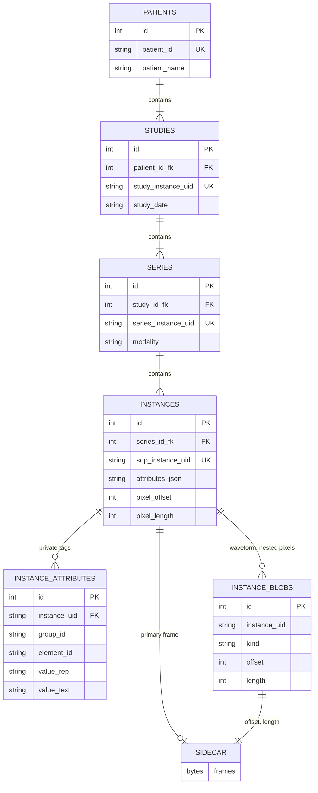

# Contributing

This page is for people changing Isocenter itself: setting up a development environment, the code-quality rules, running the tests, the release process, and the internals a contributor needs that a user does not.

Work is planned in [GitHub Issues](https://github.com/kvnlng/Isocenter/issues) and [milestones](https://github.com/kvnlng/Isocenter/milestones). Good places to start are the [`good first issue`](https://github.com/kvnlng/Isocenter/labels/good%20first%20issue) and [`help wanted`](https://github.com/kvnlng/Isocenter/labels/help%20wanted) labels.

## 1. Environment Setup

Isocenter requires Python 3.12+. The floor is not arbitrary: `entities.py`
and `privacy.py` use `@dataclass(slots=True)` (3.10+), and the declared
dependency set resolves only on 3.12 and later.

```bash
# Clone the repository
git clone https://github.com/kvnlng/Isocenter.git
cd Isocenter

# Install the library, the test suite's dependencies, pylint and coverage
pip install -e ".[dev]"
```

The `dev` extra is contributor tooling only -- it pulls in `tests` plus
`pylint` and `coverage`. Somebody installing Isocenter to *use* it gets none of it;
`pip install isocenter` never installs a linter or a test runner.

## 2. Code Quality

These rules keep the code reliable and maintainable.

### Pylint

We use `pylint` to lint our codebase. The configuration is strict (`pylintrc.toml`) and we aim to keep the score above 8.5/10 for the main package.

**Run Pylint:**

```bash
# Lint the main package
pylint isocenter

# Lint tests (slightly more lenient)
pylint tests
```

**Common Rules:**

* **Imports**: All imports must be at the top-level (except for strictly necessary circular dependency breaking or rare optional heavy dependencies).
* **Docstrings**: All public modules, classes, and methods must have docstrings, in Google style. A docstring documents the code: a summary, `Args:` (one entry per parameter), `Returns:`/`Yields:`, `Raises:` (one entry per exception the function raises) and what a caller needs to know to use it. It is rendered in the API reference. Change history belongs in `CHANGELOG.md`, and reasoning for someone editing the body belongs in a `#` comment at the line it explains. `pylint.extensions.docparams` is enabled in `pylintrc.toml` and reports a missing parameter, return, yield or raise entry in the docstring of every function and method whose name does not start with `_`. Private names (`_x`), dunders and `__init__` are not checked and need no docstring, so constructor parameters, whether documented on the class or on `__init__`, are not checked either; nor are module docstrings. Keep those complete by hand.
* **Encodings**: All `open()` calls must specify `encoding='utf-8'` to prevent cross-platform issues.

### Formatting

(Optional) We recommend using `black` for formatting, though it is not currently enforced by CI.

## 3. Testing

We use `pytest` for our test suite.

**Run the tests that exercise what your branch changed:**

```bash
pytest -v --changed
```

It prints which selection it used. The whole suite (`pytest`) runs when a release is cut; `RELEASING.md` says when each is required.

**Run specific tests:**

```bash
pytest tests/test_session.py
```

Every test runs in its own temporary directory, so a test that writes relative paths does not touch the checkout.

### Benchmarks

We have a dedicated benchmark suite in `tests/benchmarks/`.

```bash
# Run the stress test; --input and --output are required
python -m tests.benchmarks.run_stress_test --input <dicom-dir> --output <out-dir>
```

[Performance](performance.md) records the one benchmark run with its machine and date.

## 4. Release Process

The procedure -- how changes reach `main`, how a release branch is cut,
tagged and published, how patch releases work -- lives in
[`RELEASING.md`](https://github.com/kvnlng/Isocenter/blob/main/RELEASING.md)
in the repository root, next to the code it releases. In short: `main` is
the development branch; each minor line is cut to a frozen `release/X.Y`
branch; a version is the tag `vX.Y.Z` on it; and nothing publishes itself.

Publishing is a manual run of `.github/workflows/publish.yml` against the
tag. It uploads to PyPI by Trusted Publishing -- GitHub authenticates over
OIDC and PyPI matches the request against a publisher pinned to this
repository, the workflow's *filename*, and its environment name. There is
no API token in repository secrets, in CI, or on anyone's machine.
Renaming `publish.yml` or its environments breaks publishing until PyPI's
publisher configuration is updated to match.

Before anything is uploaded, the build job checks the run. The target must
be exactly `pypi` or `testpypi`. The built wheel must match
`isocenter/_version.py`, the one place the version is declared. A run to
`pypi` must be dispatched from a `v*` tag that matches both; a TestPyPI
rehearsal may run from the release branch, and a tag, if it runs from one,
must match too. It then installs the
built wheel into a clean environment *outside the source tree* and asserts
it carries its own `resources/*.json`. That gate exists because those
resources once shipped in no distribution at all and nothing failed --
every loader guards on `os.path.exists` and degrades to a default, so a
published release audited against an empty PHI policy and reported clean.

**If `test-supported` (3.13, 3.14) is red, that is a decision, not a
formality.** It only reports; it cannot block the upload. Either fix it,
or delete that classifier from `setup.py` before releasing -- `setup.py`
says outright that a classifier CI does not back is the same unbacked
promise the old `python_requires=">=3.9"` was. A red job here is *more*
likely to be a flake than a real break (v0.9.1's publish had 3.13 fail and
pass on rerun), which is exactly what makes it dangerous: "just rerun it"
is the reading that ships a real break. Rerun to learn whether it is
deterministic, not to make it go away. That is why `RELEASING.md` rehearses
on TestPyPI, from the release branch, before tagging.

### Archiving and DOIs

Once the Zenodo GitHub integration is enabled for this repository, each
published GitHub Release is archived and issued a version DOI, under a
concept DOI that always resolves to the latest. `.zenodo.json` supplies
the deposit metadata and `CITATION.cff` is what GitHub's "Cite this
repository" button reads.

Zenodo only archives releases created *after* the integration is
switched on; it does not backfill -- its own guide says "once connected,
new releases from the repository will be automatically ingested and
archived". So enabling it does nothing to the releases already published:
the first deposit comes from the next release, or from deleting and
re-creating an existing GitHub Release. Creating a GitHub Release uploads
nothing: publishing is a separate manual run (`RELEASING.md`), so the
Release can be made, or re-made for Zenodo, without touching PyPI.

The integration is enabled and the first deposit exists, from v0.8.1.
The **concept** DOI is `10.5281/zenodo.22104298` -- that is what
`CITATION.cff` and the README badge carry, and it always resolves to the
latest version. Zenodo also mints a per-version DOI for each release, one
digit away; do not substitute it, or the citation stops following the
work. `tests/test_version_contract.py` pins both the value and the
agreement between the two files.

`.zenodo.json` supplies the metadata the record is minted from. Two
things about it are easy to get wrong and are pinned by
`tests/test_version_contract.py`:

* **`license` is a Zenodo vocabulary id, not an SPDX id**, and those are
  lowercase. `apache-2.0` resolves at
  `zenodo.org/api/vocabularies/licenses/`; the SPDX spelling
  `Apache-2.0` returns 404, and would have gone into the record as a
  licence Zenodo could not match. (The same held for `agpl-3.0-or-later`
  before #348 changed the licence.)
* **No `version` field.** The GitHub integration fills it in from the
  release tag. Pinning it here would add a third place for the number to
  drift.

Record metadata can be corrected on Zenodo after publication; the DOI
itself cannot be reissued.

## Storage schema

The session store is `<name>.db` (SQLite) plus `<name>_pixels.bin`, an append-only sidecar. The layout below is internal: it is not part of the frozen API, and a release may change it. [Architecture](architecture.md#4-storage) has the user's view.

### Why the split

DICOM metadata comes in two shapes. Standard tags are well-defined and present on most instances; private tags are vendor-specific, sparse and numerous. One table with a column per tag is impossible, and a single entity-attribute-value table is too slow to load in bulk. So values are split by group parity and type when they are saved:

| Where | Table / file | What | Why |
| :--- | :--- | :--- | :--- |
| Core attributes | `instances.attributes_json` | Every standard (even-group) tag, and every binary value that is kept, private ones included | One JSON document per instance, read back whole: no SQL reads inside it and no joins, so 10,000 instances load without 10,000 joins. |
| Private attributes | `instance_attributes` | Private (odd-group) tags that are not binary | Sparse, vendor-specific; keeps the core document small. |
| Pixel and waveform data | `<name>_pixels.bin`, located by `instances.pixel_offset`/`pixel_length` and `instance_blobs` | Raw frame bytes | Keeps gigabytes out of the database. |

The real split for private values is whether a value serializes to text: a kept binary value is base64-encoded into `attributes_json` even when it is private, and its VR is recorded in the document's root `__vrs__`. DS and IS values are stored as tagged text (`{"__type__": "DS", "data": ...}`) because `json` writes a float or int subclass as a bare number. There is no fourth tier for large binary values: only Pixel Data and Waveform Data go to the sidecar, and any other binary value over 65534 bytes is dropped at ingest with a `DATA_LOSS` row, because an unbounded value would stay resident for the life of the session. [Private Tags](configuration.md#private-tags) gives the reasoning users see.

### Tables

Every table has an integer `id` primary key; the natural keys are `UNIQUE` columns.

| Table | Holds | Key columns |
| :--- | :--- | :--- |
| `patients` | One row per patient | `patient_id` (UNIQUE), `patient_name`, `phi_status`, `phi_policy`, `phi_policy_base`, `phi_status_edited`, `jitter_scheme` |
| `project_secret` | The one per-project secret (`id = 1`) that keys pseudonyms, date offsets and replacement UIDs | `secret_hex`, `origin`, `created_at` |
| `studies` | One row per study | `study_instance_uid` (UNIQUE), `patient_id_fk`, `study_date`, `date_shifted`, `shifted_study_date`, the four PHI-status columns |
| `series` | One row per series | `series_instance_uid` (UNIQUE), `study_id_fk`, `modality`, `series_number`, `manufacturer`, `model_name`, `device_serial_number` |
| `instances` | One row per instance (one file) | `sop_instance_uid` (UNIQUE), `series_id_fk`, `sop_class_uid`, `instance_number`, `file_path`, `source_path`, `pixel_offset`, `pixel_length`, `pixel_hash`, `compress_alg`, `attributes_json`, `shift_provenance`, the four PHI-status columns |
| `instance_attributes` | Private, non-binary values | `instance_uid`, `group_id`, `element_id`, `atom_index`, `value_rep`, `value_text`, `value_count`; UNIQUE on the first four |
| `instance_blobs` | Sidecar references other than the instance's own Pixel Data: waveform samples, and pixel data inside a sequence item such as an icon image | `instance_uid`, `kind` (`waveform`, or `pixels:<path>` such as `pixels:0088,0200/0/7fe0,0010`), `offset`, `length`, `hash`, `compress_alg`; UNIQUE on `(instance_uid, kind)` |
| `audit_log` | Every action the pipeline records, read by the compliance report | `timestamp`, `action_type`, `entity_uid`, `details`, `loss_scope` (DATA_LOSS rows), `element_tag` (SCAN_GAP rows) |
| `phi_findings` | Findings saved by `save_analysis()` | `entity_uid`, `entity_type`, `field_name`, `value`, `reason`, `patient_id`, `remediation_action`, `remediation_value`, `details_json` |

`persistence.py` holds the `CREATE TABLE` statements and the `ALTER TABLE` steps that add a column to a store created without it. Nothing is back-filled: a column added later is NULL in older rows, and the loader reads NULL as "not recorded".



`audit_log`, `phi_findings` and `project_secret` stand alone: they refer to entities by UID in their text columns, not by foreign key.

## Tests behind the documented defaults

Several numbers in [Environment Variables](environment.md) are pinned by tests, so the page and the code cannot drift apart silently:

- `tests/test_documented_env_vars.py` fails when the package reads an `ISOCENTER_*` variable that has no row in the table: a table row whose first cell is the variable's name in bold code.
- `tests/test_parallel_contract.py` holds the default worker count (one per CPU), the order the threads-or-processes levers resolve in, and the rule that only the literal `1` switches a flag on.
- `tests/test_redaction_worker_count.py` holds `redact()`'s own default (half the CPUs, capped at eight) at fixed CPU counts, so the cap is exercised on any machine.
- `tests/test_shared_executor_lifecycle.py` holds the `WARNING`s `ingest()` logs when `ISOCENTER_FORCE_THREADS` or `ISOCENTER_MAX_TASKS_PER_CHILD` is set.

Change the page and the test together.

## Measuring coverage in worker processes

`ingest()` and `export()` always run in worker processes, so a debugger or a plain `coverage run` in the calling process does not see them. `.coveragerc` measures the spawned workers too; its comments say why each setting is there:

```bash
coverage run -m pytest tests/ && coverage combine && coverage report
```

Coverage is not run in CI and has no threshold.

`ISOCENTER_WORKER_FAULTHANDLER=1` makes every worker process dump its threads' tracebacks to stderr if it is still alive after 240 s. The test workflow (`.github/workflows/tests.yml`) sets it, so a stall inside a pool child shows up as a stack trace rather than a silent hang.

## Notes moved from the user pages

### Dependencies

Dependencies are declared in one place, `setup.py`. There is deliberately no `requirements.txt`: two lists drift apart, and only `install_requires` is consulted when you `pip install`. `.[tests]` is enough to run the suite; `.[dev]` adds pylint and coverage.

### `pylibjpeg-libjpeg` on the free-threaded build

Measured with `pylibjpeg-libjpeg` 2.4.0, which has no free-threaded wheel. On CPython 3.14t, `pip install` builds it from the sdist, and the build either fails or produces a wheel with no extension module in it, depending on the compiler pip picks. The second was measured here: the install reported success and `import libjpeg` then failed with `ModuleNotFoundError: No module named '_libjpeg'`. Built from the sdist by hand it imports, with `RuntimeWarning: The global interpreter lock (GIL) has been enabled to load module '_libjpeg', which has not declared that it can run safely without the GIL`, so a 3.14t process that imports it runs with the GIL back on unless `PYTHON_GIL=0` is set. [Codec support](codecs.md) carries the user-facing summary.

### Decode limits: the evidence

[Codec support](codecs.md#decode-limits) states each limit. The measurements behind the two precision limits:

- A precision-12 JPEG Lossless stream under BitsStored 16 reads `0..4970` through `imagecodecs` (lj92) and `0..4095` through pydicom with `pylibjpeg-libjpeg`, which saturates.
- The signed arm is measured unreachable for JPEG Baseline and Extended (`.50`/`.51`), whose decode is not sign-extended at all.
- `693_J2KR.dcm` from pydicom's test data (a signed JPEG 2000 codestream) reads `int16 [-2000, 2492]` identically through Pillow and through `imagecodecs`, and writes no row.
- An unsigned JPEG 2000 codestream under PixelRepresentation 1 is sign-extended at the codestream's own precision; measured at BitsStored 12, 13 and 16, it reads `int16 [-1996, 1470]` on both routes, with no row.
- 12-bit JPEG Extended decodes through `imagecodecs.jpeg_decode` value for value as DCMTK decodes pydicom's `JPEG-lossy.dcm`.

### `DicomExporter.write_tree()` and `session.export()`

The patient, study and series tags written over each instance's own are the same on both write paths. Equipment comes from the instance, which is what `anonymize()` edits, and a study with no Study Time is written with an empty one. `write_tree()` applies none of the export's gates (redaction zones, the nested-icon drop, the de-identification markers); it is the serializer the fixture generators in `scripts/` use.

## Configuration and storage internals

The user guides describe behaviour; the names behind it are here.

- **Profiles.** `basic@2026c` is `profiles.BASIC_PROFILE` (646 rules, frozen for 1.x; `tests/test_profile_editions.py` pins its digest). The floor is `profiles.FLOOR_POLICY`, the same table with the three research defaults `create_config()` writes. Resolution of a file's `privacy_profile` lives in `config_manager._resolved_policy`, not in `profiles.py`.
- **The 65534-byte limit** on held binary values is `io_handlers.BINARY_RETENTION_MAX_BYTES`, the largest value an explicit-VR 16-bit length field can carry.
- **Why large private values are not stored.** Holding a megabyte vendor blob in `attributes` makes it permanently resident, and memory scaling on 100GB+ datasets depends on heavy arrays never being resident by default; the cap bounds what retention can cost per element. Routing large values to the sidecar instead means giving private tags an offset/length representation the EAV table does not have, plus a lazy loader and an export re-merge path. `session.compact()` rewrites the sidecar and rewires every offset it knows about, so a class of offset it does not know about is silent corruption after the first compaction. It also holds the sidecar gate for the whole rewrite, so any writer of such an offset would have to take that gate too, and it refuses outright while a `redact()` or `ingest()` pass is open. That is design work, not a flag (#125).
- **Data-loss rows** are read with `session.store_backend.get_audit_losses()`; the compliance report's section 3.1 is the user-facing view.
